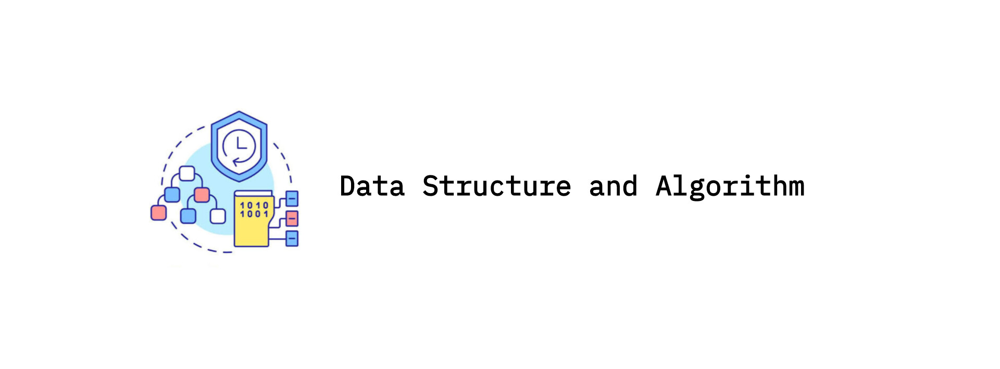

<h1 align="center">Data Structure and Algorithm</h1>




1. [DSA-1.1 Introduction to DSA](#introduction-to-dsa) 
2. [DSA-1.2 Data Structures](#data-structures)
   - [Arrays](#arrays)
     - [1.1 Array Operations](#array-operations)
     - [1.2 Array Types](#array-types)
     - [1.3 Array Sequences](#array-sequences)
   - [Linked List](#linked-list)
     - [2.1 Linked List Characteristics](#linked-list-characteristics)
     - [2.2 Linked List Operations](#linked-list-operations)
     - [2.3 Linked List Types](#linked-list-types)
   - [Stack](#stack)
     - [3.1 Stack Operations](#stack-operations)
   - [Queue](#queue)
     - [4.1 Queue Operations](#queue-operations)
     - [4.2 Queue Types](#queue-types)
   - [Heap](#heap)
     - [5.1 Heap Operations](#heap-operations)
     - [5.2 Heap Types](#heap-types)
   - [Hash](#hash)
     - [6.1 Hash Function Types](#hash-function-types)
     - [6.2 Collision Resolution Techniques](#collision-resolution-techniques)
   - [Tree](#tree)
     - [7.1 Traversal of Tree](#traversal-of-tree)
     - [7.2 Trees Classification](#trees-classification)
     - [7.3 Tree Types](#tree-types)
   - [Graphs](#graph)
     - [8.1 Traversal of Graph](#traversal-of-graph)
3. [DSA-1.3 Algorithms](#algorithms)
   - [Sort](#sorting-algorithm)
     - [1.1 Bubble Sort](#bubble-sort)
     - [1.2 Selection Sort](#selection-sort)
     - [1.3 Insertion Sort](#insertion-sort)
     - [1.4 Quick Sort](#quick-sort)
     - [1.5 Merge Sort](#merge-sort)
   - [Search](#searching-algorithm)
     - [2.1 Linear Search](#linear-search)
     - [2.2 Binary Search](#binary-search)
     - [2.3 Ternary Search](#ternary-search)
     - [2.4 Jump Search](#jump-search)

## Introduction to DSA

**Data Structure and Algorithm (DSA)** is a fundamental concept in computer science that deals with the efficient _storage_, _retrieval_, and _manipulation_ of data. It is a crucial aspect of software development, as it enables developers to write efficient, scalable, and maintainable code.

## Data Structures

   > **Data Structure** is a particular way of storing and organizing data in the memory of the computer so that these data can easily be retrieved and efficiently utilized in the future when required.

**Primitive Data Structures** are basic data structures provided by programming languages to represent single values, such as integers, floating-point numbers, characters, and booleans.   

**Abstract Data Structures** are higher-level data structures that are built using primitive data types and provide more complex and specialized operations. Some common examples of abstract data structures include arrays, linked lists, stacks, queues, trees, and graphs.

## Arrays

   > **Array** is a linear data structure that stores a collection of elements of the same data type. Elements are allocated contiguous memory, allowing for constant-time access. Each element has a unique index number.

## Array Operations 

- **Traversal:** Iterating through the elements of an array.

  ```python 
  arr = [2, 4, 6, 8, 10]
  for element in arr:
    print(element)
  ```
   
- **Insertion:** Adding an element to the array at a specific index.

  ```python 
  arr = [2, 4, 6, 8, 10]
  index = 4
  new_element = 12
  
  arr.insert(index, new_element)
  print(arr)
  ```
   
- **Deletion:** Removing an element from the array at a specific index.

  ```python 
  arr = [2, 4, 6, 8, 10]
  index = 2 
  
  del arr[index]
  print(arr)
  ```
   
- **Searching:** Finding an element in the array by its value or index.

  ```python 
  arr = [2, 4, 6, 8, 10]
  
  # -> by value 
  value = 6 
  if value in arr:
    index = arr.index(value)
    print(f'Element {value} found in index {index}.')
  else:
    print(f'Element {value} not found.')
  
  # -> by index 
  index = 2 
  if 0 <= index < len(arr):
    print(f'Element value at index {index} is {arr[index]}')
  else:
    print('Index out of bound.')
  ```

## Array Types

- **One-dimensional Array:** A simple array with a single dimension.
  
  ```python
  arr = [2, 4, 6, 8, 10]
  ```

- **Multi-dimensional Array:** An array with multiple dimensions, such as a matrix.
  
  ```python
  arr = [[2, 4, 6,], [8, 10, 12], [14, 16, 18]]
  ```

## Array Sequences 
   > An **array sequence** is a data structure that can hold multiple items of the same type. 

Here are some common types of array sequence in python programming:

- **List:** A dynamic array that can hold items of different types, but is most commonly used to hold items of the same type.

  ```python
  list_sample = [2, 4, 6, 8, 10]
  ```
   
- **Tuple:** An immutable array sequence, meaning its content cannot be changed after creation.
  
  ```python
  tuple_sample = (2, 4, 6, 8, 10)
  ```

- **String:** An immutable sequence of characters used to represent text. Strings are enclosed in either single quotes ('), double quotes ("), or triple quotes (''' or """) for multi-line strings. 

  ```python
  string_sample1 = 'I Love Data Structure and Algorithm'
  string_sample2 = "I Love Data Structure and Algorithm"
  string_sample3 = '''I Love Data Structure and Algorithm'''
  ```

## Linked List 

   > A **Linked List** is a linear data structure that stores data in nodes, which are connected by pointers. Unlike arrays, linked lists are not stored in contiguous memory locations.
   
## Linked List Characteristics

- **Dynamic:** Linked lists can be easily resized by adding or removing nodes.
- **Non-contiguous:** Nodes are stored in random memory locations and connected by pointers.
- **Sequential access:** Nodes can only be accessed sequentially, starting from the head of the list.

## Linked List Operations 

> Initialize Linked List:

```python 
class LinkedList:
  def __init__(self, data):
    self.data = data
    self.next_node = None
```

- **Creation:** Creating a new linked list or adding a new node to an existing list.
   
  ```python
  # -> new  nodes
  node1 = Node(28)
  node2 = Node(32)
  node3 = Node(46)
  
  # -> linking nodes 
  node1.next = node2
  node2.next = node3
  ```

- **Traversal:** Iterating through the list and accessing each node.

  ```python 
  current_node = node1
  
  while current_node:
    print(current_node.data)
    current_node = current_node.next
  ```

- **Insertion:** Adding a new node at a specific position in the list.

  ```python 
  # -> at the beginning
  new_node = Node(54)
  new_node.next = node1
  node1 = new_node
  
  # -> at the end 
  new_node = Node(54)
  current_node = node1
  
  while current_node.next:
    current_node = current_node.next 
  current_node.next = new_node
  
  # -> specific position 
  new_node = Node(54)
  insert_pos = 2 
  current_node = node1 
  count_init = 0  
  
  while count_init < insert_pos -1:
    current_node = current_node.next 
    count_init += 1  
  new_node.next = current_node.next 
  current_node.next = new_node
  
  ```

- **Deletion:** Removing a node from the list.

  ```python 
  remove_value = 32
  current_node = node1
  
  if current_node.data == remove_value:
    node1 = current_node.next 
  else:
    while current_node.next and current_node.next.data != remove_value:
      current_node = current_node.next 
    if current_node.next:
      current_node.next = current_node.next.next 
  ```

- **Search:** Finding a node with a specific value in the list.
  ```python 
  search_value = 46
  current_node = node1
  value_found = False
      
  while current_node:
    if current_node.data == search_value:
      value_found = True 
      break
    current_node = current_node.next 
      
  if value_found:
    print('Value found in the list.')
  else:
    print('Value not found.')
      
  ```

## Linked List Types 

- **Singly Linked List:** Each node points to the next node in the list.

  ```python
  class Node:
    def __init__(self, data):
      self.data = data 
      self.next_node = None
   
  # -> new nodes
  node1 = Node(28)
  node2 = Node(32)
  node3 = Node(46)
   
  # -> linking nodes 
  node1.next_node = node2
  node2.next_node = node3
   
  # -> traversing list 
  current_node = node1
   
  while current_node:
    print(current_node.data, end=' --> ')
    current_node = current_node.next_node
  print('End')
  ```

- **Doubly Linked List:** Each node points to both the next and previous nodes in the list.


  ```python 
  class Node:
    def __init__(self, data):
      self.data = data 
      self.next_node = None
      self.prev_node = None
      
  # -> new nodes
  node1 = Node(28)
  node2 = Node(32)
  node3 = Node(46)
   
  # -> linking nodes 
  node1.next_node = node2
  node2.prev_node = node1 
  node2.next_node = node3
  node3.prev_node = node2
  
  # -> traversing list 
  
  # -> forward 
  current_node = node1
  
  while current_node:
    print(current_node.data, end=' <--> ')
    current_node = current_node.next_node 
  print('End')
  
  # -> backward 
  current_node = node3
  
  while current_node:
    print(current_node.data, end=' <--> ')
    current_node = current_node.prev_node
  print('End')
  
  ```
- **Circular Linked List:** The last node points back to the first node, forming a circular loop.

  ```python 
  class Node:
    def __init__(self, data):
      self.data = data
      self.next_node = None 
  
  # -> new nodes 
  node1 = Node(28)
  node2 = Node(32)
  node3 = Node(46)
  
  # -> linking nodes
  node1.next_node = node2
  node2.next_node = node3
  node3.next_node = node1
  
  # -> traversing list
  current_node = node1
  count_init = 0  
  limit_count = 10  
  
  while count_init < limit_count:
    print(current_node.data, end=' --> ')
    current_node = current_node.next_node
    count_init += 1  
  print('Head')
  ```

## Stack

   > **Stack** is a linear data structure that follows a particular order in which the operations are performed. The order may be _LIFO(Last In First Out)_ or _FILO(First In Last Out)_. **LIFO** implies that the element that is inserted last, comes out first and **FILO** implies that the element that is inserted first, comes out last.

## Stack Operations 

> Initialize Stack:

```python 
class Stack:
  def __init__(self):
    self.stack = []
```
- **Push:** Adds an element to the top of the stack.

  ```python
  def push(self, element):
    self.stack.append(element)
  ```
   
- **Pop:** Removes and returns the element at the top of the stack.

  ```python
  def pop(self):
    if not self.is_empty():
      return self.stack.pop()
    else:
      return 'Stack is empty.'
  ```

- **Peek:** Returns the element at the top of the stack without removing it.

  ```python
  def peek(self):
    if not self.is_empty():
      return self.stack[-1]
    else:
      return 'Stack is empty.'
  ```

- **Size:** Returns the number of elements in the stack.

  ```python
  def size(self):
    return len(self.stack)
  ```

- **IsEmpty:** Checks if the stack is empty.

  ```python
  def is_empty(self):
    return len(self.stack) == 0
  ```

## Queue 

   > A **Queue** Data Structure is a fundamental concept in computer science used for storing and managing data in a specific order. It follows the principle of “First in, First out” (FIFO), where the first element added to the queue is the first one to be removed.

## Queue Operations 

> Initialize Queue:

```python 
class Queue:
  def __init__(self, queue_size):
    self.queue = []
    self.max_size = queue_size
```

- **Enqueue:** Adds an element to the rear of the queue.
   
  ```python
  def enqueue(self, item):
    if self.is_full():
      return 'Queue is full cannot enqueue.'
    else:
      self.queue.append(item)
      return f'Enqueued: {item}'
  ```

- **Dequeue:** Removes an element from the front of the queue.

  ```python
  def dequeue(self):
    if self.is_empty():
      return 'Queue is empty cannot dequeue.'
    else:
      item = self.queue.pop(0)
      return f'dequeued: {item}'
  ```

- **Peek:** Retrieves the front element without removing it.

  ```python
  def peek(self):
    if self.is_empty():
      return 'Queue is full nothing to peek.'
    else:
      return f'Front element: {self.queue[0]}'
  ```

- **IsEmpty:** Checks if the queue is empty.

  ```python
  def is_empty(self):
    return len(self.queue) == 0
  ```

- **IsFull:** Checks if the queue is full.

  ```python
  def is_full(self):
    return len(self.queue) == self.max_size
  ```

## Queue Types 

- **Circular Queue:** Last element connects to the first element.

  ```python
  class CircularQueue:
    def __init__(self, queue_size):
      self.queue = [None] * queue_size
      self.max_size = queue_size
      self.front_pos = self.back_pos = -1 
        
    def enqueue(self, item):
      if (self.back_pos + 1) % self.max_size == self.front_pos:
        # -> if queue is full
        return 'Queue is full cannot enqueue.'
      elif self.front_pos == -1:
        # -> if queue is empty start from front position
        self.front_pos = self.back_pos = 0
        self.queue[self.back_pos] = item 
      else:
        # -> move back position to the next position in circular manner
        self.back_pos = (self.back_pos + 1) % self.max_size
        self.queue[self.back_pos] = item
      return f'Enqueue item: {item}'
        
    def dequeue(self):
      if self.front_pos == -1:
        # -> if queue is empty
        return 'Queue is empty cannot dequeue.'
      elif self.front_pos == self.back_pos:
        # -> if there is one element reset pointers 
        temp = self.queue[self.front_pos]
        self.front_pos = back_pos = -1
        return temp 
      else:
        # -> move front position to the next position in circular manner
        temp = self.queue[self.front_pos]
        self.front_pos = (self.front_pos + 1) % self.max_size
        return temp 
        
    def show(self):
      if self.front_pos == -1:
        # -> if queue is empty
        return 'Queue is empty.'
      elif self.back_pos >= self.front_pos:
        # -> if back is not wrapped arround
        return self.queue[self.front_pos:self.back_pos + 1]
      else:
        # -> if back is wrapped arround 
        return self.queue[self.front_pos:] + self.queue[:self.back_pos + 1]
      
  # -> new queue in size of 7
  cq = CircularQueue(7)
  print(cq.enqueue(23))
  print(cq.enqueue(29))
  print(cq.enqueue(32))
  print(cq.enqueue(36))
  print(cq.enqueue(48))
  print(cq.enqueue(52))
  print(cq.enqueue(64)) 
  print(f'Queue: {cq.show()}')
  print(f'Removed item: {cq.dequeue()}')
  print(f'Updated Queue: {cq.show()}')
  ```

- **Double-Ended Queue (Deque):** Operations can be performed from both ends.

  ```python
  class DoubleEndedQueue:
    def __init__(self):
      self.deque = []
        
    def add_front(self, item):
      self.deque.insert(0, item)
        
    def add_back(self, item):
      self.deque.append(item)
        
    def remove_front(self):
      if self.is_empty():
        return 'Deque is empty.'
      return self.deque.pop(0)
        
    def remove_back(self):
      if self.is_empty():
        return 'Deque is empty.'
      return self.deque.pop()
        
    def is_empty(self):
      return len(self.deque) == 0
        
    def show(self):
      return self.deque
      
  # -> new double ended queue 
  dq = DoubleEndedQueue()
  dq.add_front(27)
  dq.add_back(89)
  dq.add_front(32)
  print(f'Deque: {dq.show()}')
  print(f'Remove front: {dq.remove_front()}')
  print(f'Remove back: {dq.remove_back()}')
  print(f'Dequeue is empty: {dq.is_empty()}')
  print(f'Deque: {dq.show()}')
  ```

- **Priority Queue:** Elements are arranged based on priority.

  ```python
  class PriorityQueue:
    def __init__(self):
      self.queue = []
        
    def insert(self, item, priority):
      self.queue.append((item, priority))
      self.queue.sort(key=lambda x : x[1], reverse=True)
        
    def delete(self):
      if self.is_empty():
        return 'Queue is empty.'
      return self.queue.pop(0)[0]
        
    def is_empty(self):
      return len(self.queue) == 0  
        
    def show(self):
      return [item[0] for item in self.queue]
      
  # -> new priority queue
  pq = PriorityQueue()
  pq.insert('Bath', 3)
  pq.insert('Eat', 2)
  pq.insert('Sleep', 1)
  pq.insert('Work', 4)
  print(f'Priority Queue: {pq.show()}')
  print(f'Remove item: {pq.delete()}')
  print(f'Updated Priority Queue: {pq.show()}')
  ```
   
## Heap

   > A **Heap** is a complete binary tree data structure that satisfies the heap property: for every node, the value of its children is less than or equal to its own value. Heaps are usually used to implement **priority queues**, where the smallest (or largest) element is always at the root of the tree.

## Heap Operations 

> Initialize Heap:

```python 
class Heap:
  def __init__(self):
    self.heap = []
```

- **Insert:** Adds a new element to the heap while maintaining heap properties.

  ```python
  def insert(self, item):
    self.heap.append(item)
    self._heap_insertion_min(len(self.heap - 2))
      
  def _heap_insertion_min(self, index):
    head = (index - 1) // 2
        
    if index > 0 and self.heap[index] < self.heap[head]:
      self.heap[index], self.heap[head] = self.heap[head], self.head[index]
      self._heap_insertion_min(head)
      
  def _heap_insertion_max(self, index):
    head = (index - 1) // 2
        
    if index > 0 and self.heap[index] > self.heap[head]:
      self.heap[index], self.heap[head] = self.heap[head], self.head[index]
      self._heap_insertion_max(head)
  ```

- **Extract-Max/Extract-Min:** Removes the root element and restructures the heap.

   > Extract Min:

  ```python
  def extract_min(self):
    if not self.heap:
      return 'Heap is empty.'
        
    min_value = self.heap[0]
    self.heap[0] = self.heap.pop()
    self._heap_extraction(0)
    return min_value
      
  def _heap_extraction(self, index):
    smallest_num = index
    left_index = 2 * index + 1
    right_index = 2 * index + 2 
        
    if left_index < len(self.heap) and self.heap[left_index] < self.heap[smallest_num]:
      smallest_num = left_index
    if right_index < len(self.heap) and self.heap[right_index] < self.heap[smallest_num]:
      smallest_num = right_index
    if smallest_num != index:
      self.heap[index], self.heap[smallest_num] = self.heap[smallest_num], self.heap[index]
      self._heap_extraction(smallest_num)
  ```

   > Extract Max:

  ```python
  def extract_max(self):
    if not self.heap:
      return 'Heap is empty.'
        
    max_value = self.heap[0]
    self.heap[0] = self.heap.pop()
    self._heap_extraction(0)
    return max_value
      
  def _heap_extraction(self, index):
    largest_num = index
    left_index = 2 * index + 1
    right_index = 2 * index + 2 
        
    if left_index < len(self.heap) and self.heap[left_index] > self.heap[largest_num]:
      largest_num = left_index
    if right_index < len(self.heap) and self.heap[right_index] > self.heap[largest_num]:
      largest_num = right_index
    if largest_num != index:
      self.heap[index], self.heap[largest_num] = self.heap[largest_num], self.heap[index]
      self._heap_extraction(largest_num)
  ```

- **Increase/Decrease Key:** Updates the value of a node and restructures the heap.

   > Increase key:

  ```python 
  def increase_key(self, index, new_item):
    if index >= len(self.heap):
      raise IndexError('Index out of bound')
        
    self.heap[index] = new_item
    self._heap_insertion_max(index)
  ```

   > Decrease key:

  ```python 
  def decrease_key(self, index, new_item):
    if index >= len(self.heap):
      raise IndexError('Index out of bound')
        
    self.heap[index] = new_item
    self._heap_insertion_min(index)
  ```

## Heap Types

- **Max-Heap:** Root node has the maximum value among its children.
  ```python
  class MaxHeap:
    def __init__(self):
      self.heap = []
        
    def __str__(self):
      return str(self.heap)
        
    def insert(self, item):
      self.heap.append(item)
      self._heap_insertion(len(self.heap) - 1)
        
    def extract_max(self):
      if not self.heap:
        return 'Heap is empty.'
      if len(self.heap) == 1:
        return self.heap.pop()
            
      max_value = self.heap[0]
      self.heap[0] = self.heap.pop()
      self._heap_extraction(0)
      return max_value
        
    def increase_key(self, index, new_item):
      if index >= len(self.heap):
        raise IndexError('Index out of bound')
        
      self.heap[index] = new_item
      self._heap_insertion(index)
        
    def _heap_insertion(self, index):
      head = (index - 1) // 2
        
      if index > 0 and self.heap[index] > self.heap[head]:
        self.heap[index], self.heap[head] = self.heap[head], self.heap[index]
        self._heap_insertion(head)  
            
    def _heap_extraction(self, index):
      largest_num = index
      left_index = 2 * index + 1
      right_index = 2 * index + 2 
        
      if left_index < len(self.heap) and self.heap[left_index] > self.heap[largest_num]:
        largest_num = left_index
      if right_index < len(self.heap) and self.heap[right_index] > self.heap[largest_num]:
        largest_num = right_index
      if largest_num != index:
        self.heap[index], self.heap[largest_num] = self.heap[largest_num], self.heap[index]
        self._heap_extraction(largest_num)
      
  heap = MaxHeap()
  heap.insert(27)
  heap.insert(63)
  heap.insert(46)
  heap.insert(18)
  print(f'Heap: {heap}')
  print(f'Extract: {heap.extract_max()}')
  print(f'Extract: {heap.extract_max()}')
  heap.increase_key(1, 84)
  print(f'Heap: {heap}')
  ```

- **Min-Heap:** Root node has the minimum value among its children.

  ```python
  class MinHeap:
    def __init__(self):
      self.heap = []
        
    def __str__(self):
      return str(self.heap)
        
    def insert(self, item):
      self.heap.append(item)
      self._heap_insertion(len(self.heap) - 1)
        
    def extract_min(self):
      if not self.heap:
        return 'Heap is empty.'
      if len(self.heap) == 1:
        return self.heap.pop()
            
      min_value = self.heap[0]
      self.heap[0] = self.heap.pop()
      self._heap_extraction(0)
      return min_value
        
    def decrease_key(self, index, new_item):
      if index >= len(self.heap):
        raise IndexError('Index out of bound')
            
      self.heap[index] = new_item
      self._heap_insertion(index)
        
    def _heap_insertion(self, index):
      head = (index - 1) // 2
        
      if index > 0 and self.heap[index] < self.heap[head]:
        self.heap[index], self.heap[head] = self.heap[head], self.heap[index]
        self._heap_insertion(head)
        
    def _heap_extraction(self, index):
      smallest_num = index
      left_index = 2 * index + 1
      right_index = 2 * index + 2 
        
      if left_index < len(self.heap) and self.heap[left_index] < self.heap[smallest_num]:
        smallest_num = left_index
      if right_index < len(self.heap) and self.heap[right_index] < self.heap[smallest_num]:
        smallest_num = right_index
      if smallest_num != index:
        self.heap[index], self.heap[smallest_num] = self.heap[smallest_num], self.heap[index]
        self._heap_extraction(smallest_num)
            
  heap = MinHeap()
  heap.insert(27)
  heap.insert(63)
  heap.insert(46)
  heap.insert(18)
  print(f'Heap: {heap}')
  print(f'Extract: {heap.extract_min()}')
  print(f'Extract: {heap.extract_min()}')
  heap.decrease_key(1, 12)
  print(f'Heap: {heap}')
  ```

## Hash 

   > **Hashing** is a technique that generates a fixed-size output _(hash value)_ from an input of variable size using mathematical formulas called hash functions. Hashing is used to determine an index or location for storing an item in a data structure, allowing for efficient retrieval and insertion.

Key Concepts:

- **Hash Function:** A mathematical function that maps an input to a hash value.

  ```python 
  def hash_function(key):
    return hash(key)
  ```

- **Hash Table:** A data structure that stores key-value pairs, where the key is a hash value and the value is the actual data.

  ```python 
  class HashTable:
    def __init__(self, slot_size):
      self.slot_size = slot_size
      self.table = [None] * slot_size
        
    def hash_function(self, key):
      return hash(key) %  self.slot_size
        
    def insert(self, key_item, value_item):
      index = self.hash_function(key_item)
      self.table[index] = value_item
        
    def retrieve(self, key_item):
      index = self.hash_function(key_item)
      return self.table[index] 
      
  ht = HashTable(20)
  ht.insert('python', 'programming language')
  ht.insert('stacks', 'data structure')
  ht.insert('windows', 'operating system')
      
  print(f'Retrieved value for python: {ht.retrieve("python")}')
  print(f'Retrieved value for stacks: {ht.retrieve("stacks")}')
  print(f'Retrieved value for windows: {ht.retrieve("windows")}')
  ```
  
- **Collision:** occurs when two different keys hash to the same index. A common way to handle collisions is chaining, where each table entry points to a linked list of values that hash to the same index.

  ```python 
  class HashTableChaining:
    def __init__(self, slot_size):
      self.slot_size = slot_size
      self.table = [[] for n in range(slot_size)]
        
    def hash_function(self, key):
      return hash(key) % self.slot_size
        
    def insert(self, key_item, value_item):
      index = self.hash_function(key_item)
      self.table[index].append((key_item, value_item))
        
    def retrieve(self, key_item):
      index = self.hash_function(key_item)
          
      for (key, value) in self.table[index]:
        if key == key_item:
          return value 
      return None 
      
  htc = HashTableChaining(20)
  htc.insert('python', 'programming language')
  htc.insert('stacks', 'data structure')
  htc.insert('windows', 'operating system')
      
  print(f'Retrieved value for python: {htc.retrieve("python")}')
  print(f'Retrieved value for stacks: {htc.retrieve("stacks")}')
  print(f'Retrieved value for windows: {htc.retrieve("windows")}')
  ```


## Hash Function Types

- **Division Method:** Divides the input by a constant and uses the remainder as the hash value.

  ```python 
  def division_hash(key_item, slot_size):
    return hash(key_item) % slot_size
        
  key_item = 'Computer Science'
  slot_size = 100  
  print(f'Division hash value for `{key_item}` is {division_hash(key_item, slot_size)}')
  ```

- **Mid Square Method:** Squares the input and takes the middle digits as the hash value.

  ```python 
  def midsquare_hash(key_item, slot_size):
    hashed_key = hash(key_item)
    squared_key = hashed_key * hashed_key
    str_key = str(squared_key)
    mid_index = len(str_key) // 2 
    mid_digit = str_key[mid_index-1:mid_index+2]
    return int(mid_digit) % slot_size
      
  key_item = 'Computer Science'
  slot_size = 100
  print(f'Mid Square hash value for {key_item} is {midsquare_hash(key_item, slot_size)}')
  ```
   
- **Folding Method:** Divides the input into equal-sized blocks and adds them together to get the hash value.

  ```python 
  def folding_hash(key_item, slot_size):
    hashed_key = hash(key_item)
    str_key = str(hashed_key)
    block_size = 2 
    total = 0
        
    for n in range(0, len(str_key), block_size):
      blocks = int(str_key[n:n+block_size])
      total += blocks
    return total % slot_size
      
  key_item = 'Computer Science'
  slot_size = 100
  print(f'Folding hash value for {key_item} is {folding_hash(key_item, slot_size)}')
  ```

- Multiplication Method: Multiplies the input by a constant and takes the fractional part as the hash value.

## Collision Resolution Techniques

- **Separate Chaining (Open Hashing):** Stores colliding elements in a linked list at the corresponding hash value.

  ```python 
  class Node:
    def __init__(self, key_item, value_item):
      self.key = key_item
      self.value = value_item
      self.next = None 
      
  class OpenHashing:
    def __init__(self, slot_size):
      self.slot_size = slot_size
      self.table = [None] * slot_size
        
    def hash_function(self, key_item):
      return hash(key_item) % self.slot_size
          
    def insert(self, key_item, value_item):
      index = self.hash_function(key_item)
      new_node = Node(key_item, value_item)
          
      if self.table[index] is None:
        self.table[index] = new_node
      else:
        current_item = self.table[index]
            
        while current_item.next:
          if current_item.key == key_item:
            current_item.value = value_item
            return 
          current_item = current_item.next 
        current_item.next = new_node
        
    def retrieve(self, key_item):
      index = self.hash_function(key_item)
      current_item = self.table[index]
          
      while current_item:
        if current_item.key == key_item:
          return current_item.value
        current_item = current_item.next 
      return None
      
  oh = OpenHashing(20)
  oh.insert('python', 'web development')
  oh.insert('java', 'app development')
  print(f'Retrieved value for python is {oh.retrieve("python")}')
  print(f'Retrieved value for java is {oh.retrieve("java")}')
  ```

- Open Addressing (Close Hashing): Uses various strategies to find an alternative location for colliding elements within the hash table.

   > Linear Probing
   
  ```python 
  class LinearProbing:
    def __init__(self, slot_size):
      self.slot_size = slot_size
      self.table = [None] * slot_size
        
    def hash_function(self, key_item):
      return hash(key_item) % self.slot_size
        
    def insert(self, key_item, value_item):
      index = self.hash_function(key_item)
          
      while self.table[index] is not None and self.table[index][0] != key_item:
        index = (index + 1) % self.slot_size
      self.table[index] = (key_item, value_item)
        
    def retrieve(self, key_item):
      index = self.hash_function(key_item)
      start_index = index 
        
      while self.table[index] is not None:
        if self.table[index][0] == key_item:
          return self.table[index][1]
        index = (index + 1) % self.slot_size
        if index == start_index:
          break 
      return None 
      
  lp = LinearProbing(20)
  lp.insert('python', 'web development')
  lp.insert('java', 'app development')
  print(f'Retrieved value for python is {lp.retrieve("python")}')
  print(f'Retrieved value for java is {lp.retrieve("java")}')
  ```
   
   > Quadratic Probing 
   
  ```python 
  class QuadraticProbing:
    def __init__(self, slot_size):
      self.slot_size = slot_size
      self.table = [None] * slot_size
        
    def hash_function(self, key_item):
      return hash(key_item) % self.slot_size
        
    def insert(self, key_item, value_item):
      index = self.hash_function(key_item)
      n = 1   
          
      while self.table[index] is not None and self.table[index][0] != key_item:
        index = (index + n * n) % self.slot_size
        n += 1  
      self.table[index] = (key_item, value_item)
        
    def retrieve(self, key_item):
      index = self.hash_function(key_item)
      start_index = index
      n = 1
          
      while self.table[index] is not None:
        if self.table[index][0] == key_item:
          return self.table[index][1]
        index = (index + n * n) % self.slot_size
        n += 1  
        if index == start_index:
          break
      return None
      
  qp = QuadraticProbing(20)
  qp.insert('python', 'web development')
  qp.insert('java', 'app development')
  print(f'Retrieved value for python is {qp.retrieve("python")}')
  print(f'Retrieved value for java is {qp.retrieve("java")}')
  ```
   
   > Double Hashing
   
  ```python 
  class DoubleHashing:
    def __init__(self, slot_size):
      self.slot_size = slot_size
      self.table = [None] * slot_size
        
    def first_hash(self, key_item):
      return hash(key_item) % self.slot_size
        
    def second_hash(self, key_item):
      return 1 + (hash(key_item) % (self.slot_size - 1))
        
    def insert(self, key_item, value_item):
      index = self.first_hash(key_item)
      step = self.second_hash(key_item)
          
      while self.table[index] is not None and self.table[index][0] != key_item:
        index = (index + step) % self.slot_size
      self.table[index] = (key_item, value_item)
        
    def retrieve(self, key_item):
      index = self.first_hash(key_item)
      step = self.second_hash(key_item)
      start_index = index
          
      while self.table[index] is not None:
        if self.table[index][0] == key_item:
          return self.table[index][1]
        index = (index + step) % self.slot_size
        n += 1  
        if index == start_index:
          break
      return None
      
  dh = DoubleHashing(20)
  dh.insert('python', 'web development')
  dh.insert('java', 'app development')
  print(f'Retrieved value for python is {dh.retrieve("python")}')
  print(f'Retrieved value for java is {dh.retrieve("java")}')
  ```

## Tree 

   > A **tree** is a non-linear hierarchical data structure consisting of nodes connected by edges, with a top node called the root and nodes having child nodes. It is used in computer science for organizing data efficiently.

## Traversal of Tree

> Initialize Tree node:

```python
class TreeNode:
  def __init__(self, value):
    self.value = value 
    self.left_node = None 
    self.right_node = None 
```

Tree traversal methods are used to visit and process nodes in a tree data structure. The three common traversal methods are:

- **In-Order:** Visit left subtree, current node, then right subtree.

  ```python 
  def in_order_traversal(root_node):
    if root_node:
      in_order_traversal(root_node.left_node)
      print(root_node.value, end=' ')
      in_order_traversal(root_node.right_node)
      
  # -> example tree usage 
  root = TreeNode(10)
  root.left_node = TreeNode(27)
  root.right_node = TreeNode(32)
  root.left_node.left_node = TreeNode(48)
  root.left_node.right_node = TreeNode(53)
  in_order_traversal(root)
  ```

- **Pre-Order:** Visit current node, left subtree, then right subtree.

  ```python 
  def pre_order_traversal(root_node):
    if root_node:
      print(root_node.value, end=' ')
      pre_order_traversal(root_node.left_node)
      pre_order_traversal(root_node.right_node)
          
  pre_order_traversal(root)
  ```

- **Post-Order:** Visit left subtree, right subtree, then current node.

  ```python 
  def post_order_traversal(root_node):
    if root_node:
      post_order_traversal(root_node.left_node)
      post_order_traversal(root_node.right_node)
      print(root_node.value, end=' ')
          
  post_order_traversal(root)
  ```

## Trees Classification 

   > Classifications of **Trees** refer to grouping trees based on certain characteristics or criteria. This can involve categorizing trees based on their balance factor, degree of nodes, ordering properties, etc. Below are some important classification of Tree.

<table>
  <tr>
    <th>classification</th>
    <th>Description</th>
    <th>Type</th>
    <th>Description</th>
  </tr>
  <tr>
    <td rowspan="3">By Degree</td>
    <td rowspan="3">
      Trees can be classified based on the maximum number of children each node can have.
    </td>
    <td><a href="#binary-tree">Binary Tree</a></td>
    <td>Each node has at most two children.</td>
  </tr>
  <tr>
    <td><a href="#ternary-tree">Ternary Tree</a></td>
    <td>Each node has at most three children.</td>
  </tr>
  <tr>
    <td><a href="#n-ary-tree">N-ary Tree</a></td>
    <td>Each node has at most N children.</td>
  </tr>
  <tr>
    <td rowspan="2">By Ordering</td>
    <td rowspan="2">Trees can be classified based on the ordering of nodes and subtrees.</td>
    <td><a href="#binary-search-tree">Binary Search Tree</a></td>
    <td>Left child < parent < right child for every node.</td>
  </tr>
  
  <tr>
    <td><a href="#heap">Heap</a></td>
    <td>Specialized binary tree with the heap property.</td>
  </tr>
  
  <tr>
    <td rowspan="2">By Balance</td>
    <td rowspan="2">Trees can be classified based on how well-balanced they are.</td>
    <td><a href="#balanaced-tree">Balanced Tree</a></td>
    <td>Heights of subtrees differ by at most one. Examples include AVL trees and Red-Black trees.</td>
  </tr>
  <tr>
    <td><a href="#unbalanced-tree">Unbalanced Tree</a></td>
    <td>Heights of subtrees can differ significantly, affecting performance in operations like search and insertion.</td>
  </tr> 
</table>  
  
  
## Tree Types 

### Binary Tree: 
- A Binary Tree Data Structure is a hierarchical data structure in which each node has at most two children, referred to as the left child and the right child.

  ```python 
  class BinaryTree:
    def __init__(self, value):
      self.value = value 
      self.left_node = None
      self.right_node = None 
        
  def in_order_traversal(root_node):
    if root_node:
      in_order_traversal(root_node.left_node)
      print(root_node.value, end=' ')
      in_order_traversal(root_node.right_node)
      
  # -> root node    
  root = BinaryTree(27)
      
  # -> left and right children of node
  root.left_node = BinaryTree(34)
  root.right_node = BinaryTree(48)
      
  # -> children of left child node
  root.left_node.left_node = BinaryTree(52)
  root.left_node.right_node = BinaryTree(63)
      
  # -> children of right node
  root.right_node.left_node = BinaryTree(74)
  root.right_node.right_node = BinaryTree(81)
      
  in_order_traversal(root)
  ```

### Ternary Tree: 
- A Ternary Tree is a special type of tree data structure. Unlike a regular binary tree where each node can have up to two child nodes.

  ```python 
  class TernaryTree:
    def __init__(self, value):
      self.value = value 
      self.left_node = None
      self.middle_node = None 
      self.right_node = None 
          
  def pre_order_traversal(root_node):
    if root_node:
      print(root_node.value, end=' ')
      pre_order_traversal(root_node.left_node)
      pre_order_traversal(root_node.middle_node)
      pre_order_traversal(root_node.right_node)
      
  # -> root node    
  root = TernaryTree(27)
      
  # -> left, middle and right children of node
  root.left_node = TernaryTree(34)
  root.middle_node = TernaryTree(48)
  root.right_node = TernaryTree(52)
      
  # -> children of left child node
  root.left_node.left_node = TernaryTree(63)
  root.left_node.middle_node = TernaryTree(75)
  root.left_node.right_node = TernaryTree(82)
      
  pre_order_traversal(root)
  ```

#### N-ary Tree: 
- Generic tree or an N-ary tree is a versatile data structure used to organize data hierarchically. Unlike binary trees that have at most two children per node, generic trees can have any number of child nodes.

  ```python 
  class N_aryTree:
    def __init__(self, value):
      self.value = value 
      self.n_child = []
        
    def add_child(self, child_node):
      self.n_child.append(child_node)
        
  def pre_order_traversal(root_node):
    if root_node:
      print(root_node.value, end=' ')
          
      for child in root_node.n_child:
        pre_order_traversal(child)
      
  root = N_aryTree(12)
      
  # -> new children of root node 
  root.add_child(N_aryTree(24))
  root.add_child(N_aryTree(26))
  root.add_child(N_aryTree(28))
      
  # -> new children of first child node 
  root.n_child[0].add_child(N_aryTree(34))
  root.n_child[0].add_child(N_aryTree(47))
      
  # -> new children of second child node 
  root.n_child[1].add_child(N_aryTree(57))
      
  # -> new children of third child node 
  root.n_child[2].add_child(N_aryTree(60))
  root.n_child[2].add_child(N_aryTree(77))
      
  pre_order_traversal(root)
  ```

### Binary Search Tree: 
- A Binary Search Tree is a data structure used in computer science for organizing and storing data in a sorted manner. Each node in a Binary Search Tree has at most two children, a left child and a right child, with the left child containing values less than the parent node and the right child containing values greater than the parent node.

  ```python 
  class Node:
    def __init__(self, value):
      self.value = value 
      self.left_node = None 
      self.right_node = None 
      
  class BinarySearchTree:
    def __init__(self):
      self.root_node = None 
        
    def insert(self, value):
      if self.root_node is None:
        self.root_node = Node(value)
      else:
        self.insert_node(self.root_node, value)
        
    def insert_node(self, root_node, value):
      if value < root_node.value:
        if root_node.left_node is None:
          root_node.left_node = Node(value)
        else:
          self.insert_node(root_node.left_node, value)
      else:
        if root_node.right_node is None:
          root_node.right_node = Node(value)
        else:
          self.insert_node(root_node.right_node, value)
        
    def search(self, value):
      return self.search_node(self.root_node, value)
        
    def search_node(self, root_node, value):
      if root_node is None or root_node.value == value:
        return root_node
      if value < root_node.value:
        return self.search_node(root_node.left_node, value)
      return self.search_node(root_node.right_node, value)
        
    def in_order_traversal(self, root_node):
      if root_node:
        self.in_order_traversal(root_node.left_node)
        print(root_node.value, end=' ')
        self.in_order_traversal(root_node.right_node)
      
  # -> new elements for bst 
  elements = [11, 67, 89, 23, 65, 74, 43]
  bst = BinarySearchTree()
      
  for n in elements:
    bst.insert(n)
      
  # -> tree traversal 
  bst.in_order_traversal(bst.root_node)
      
  search_element = bst.search(89)
  if search_element:
    print(f'Element {search_element.value} found.')
  else:
    print(f'Element {search_element}')
  ```

### Heap: 
- A Heap is a complete binary tree data structure that satisfies the heap property: for every node, the value of its children is less than or equal to its own value. 

   [Max/Min Heap](#heap-types)

### Balanced Tree: 
- A tree is considered balanced if the heights of the left and right subtrees of any node differ by at most one. In a more general sense, a balanced tree ensures that no path from the root to a leaf is significantly longer than any other such path.

  ```python 
  class Node:
    def __init__(self, value):
      self.height = 1
      self.value = value
      self.left_node = None
      self.right_node = None
      
  class AVLTree:
    def __init__(self):
      self.root_node = None
    
    def rotate_left(self, N):
      x = N.right_node
      y = x.left_node
      x.left_node = N 
      N.right_node = y
      N.height = 1 + max(self.tree_height(N.left_node), self.tree_height(N.right_node))
      x.height = 1 + max(self.tree_height(x.left_node), self.tree_height(x.right_node))
      return x   
    
    def rotate_right(self, N):
      x = N.left_node
      y = x.right_node
      x.right_node = N 
      N.left_node = y
      N.height = 1 + max(self.tree_height(N.left_node), self.tree_height(N.right_node))
      x.height = 1 + max(self.tree_height(x.left_node), self.tree_height(x.right_node))
      return x   
        
    def insert(self, value):
      self.root_node = self.insert_node(self.root_node, value)
        
    def insert_node(self, root_node, value):
      if not root_node:
        return Node(value)
      if value < root_node.value:
        root_node.left_node = self.insert_node(root_node.left_node, value)
      else:
        root_node.right_node = self.insert_node(root_node.right_node, value)
      
      root_node.height = 1 + max(self.tree_height(root_node.left_node), self.tree_height(root_node.right_node))
      balance = self.balance_tree(root_node)
      
      if balance > 1 and value < root_node.left_node.value:
        return self.rotate_right(root_node)
      if balance < -1 and value > root_node.right_node.value:
        return self.rotate_left(root_node)
      if balance > 1 and value > root_node.left_node.value:
        root_node.left_node = self.rotate_left(root_node.left_node)
        return self.rotate_right(root_node)
      if balance < -1 and value < root_node.right_node.value:
        root_node.right_node = self.rotate_right(root_node.right_node)
        return self.rotate_left(root_node)
      return root_node
    
    def tree_height(self, N):
      if N is None:
        return 0
      return N.height
    
    def balance_tree(self, N):
      if N is None:
        return 0
      return self.tree_height(N.left_node) - self.tree_height(N.right_node)
    
    def in_order_traversal(self, root_node):
      if root_node:
        self.in_order_traversal(root_node.left_node)
        print(root_node.value, end=' ')
        self.in_order_traversal(root_node.right_node)
  
  # -> new elements for AVL 
  elements = [78, 21, 56, 32, 11, 43]
  avl = AVLTree()
  
  for n in elements:
    avl.insert(n)
  
  # -> traversing tree elements
  avl.in_order_traversal(avl.root_node)
      
  ```

#### Unbalanced Tree:
- An unbalanced tree does not maintain any constraints on the balance of the subtrees. This can result in a tree where some branches are significantly deeper than others, leading to skewed structures.

  ```python 
  class Node:
    def __init__(self, value):
      self.value = value 
      self.left_node = None 
      self.right_node = None 
      
  class BinarySearchTree:
    def __init__(self):
      self.root_node = None 
        
    def insert(self, value):
      if self.root_node is None:
        self.root_node = Node(value)
      else:
        self.insert_node(self.root_node, value)
        
    def insert_node(self, root_node, value):
      if value < root_node.value:
        if root_node.left_node is None:
          root_node.left_node = Node(value)
        else:
          self.insert_node(root_node.left_node, value)
      else:
        if root_node.right_node is None:
          root_node.right_node = Node(value)
        else:
          self.insert_node(root_node.right_node, value)
    
    def in_order_traversal(self, root_node):
      if root_node:
        self.in_order_traversal(root_node.left_node)
        print(root_node.value, end=' ')
        self.in_order_traversal(root_node.right_node)
  
  # -> new elements for bst 
  elements = [11, 67, 89, 23, 65, 74, 43]
  bst = BinarySearchTree()
      
  for n in elements:
    bst.insert(n)
      
  # -> tree traversal 
  bst.in_order_traversal(bst.root_node)   
  ```

## Graph 

   > A **Graph** is a non-linear data structure consisting of a finite set of vertices(or nodes) and a set of edges that connect a pair of nodes.
    
## Traversal of Graph 

> Graph representation:

```python 
class Graph:
  def __init__(self):
    self.graph = {}
  
  def add_edge(self, key, value):
    if key not in self.graph:
      self.graph[key] = []
    if value not in self.graph:
      self.graph[value] = []
    self.graph[key].append(value)
    self.graph[value].append(key)
```

- **Breadth-First Search:** Visits nodes level by level.

  ```python 
  def breadth_first_search(graph, start_point):
    root_visited = set()
    queue = [start_point]
    root_visited.add(start_point)
    
    while queue:
      node = queue.pop(0)
      print(node, end=' ')
      
      for neighbor_node in graph[node]:
        if neighbor_node not in root_visited:
          root_visited.add(neighbor_node)
          queue.append(neighbor_node)
          
  # -> new graph bfs 
  g = Graph()
  g.add_edge(1, 4)
  g.add_edge(1, 2)
  g.add_edge(2, 8)
  g.add_edge(2, 1)
  g.add_edge(3, 2)
  g.add_edge(3, 7)
  
  breadth_first_search(g.graph, 1)
  ```

- **Depth-First Search:** Visits nodes recursively, exploring one branch at a time.

  ```python 
  def depth_first_search(graph, node, root_visited=None):
    if root_visited is None:
      root_visited = set()
    
    root_visited.add(node)
    print(node, end=' ')
    
    for neighbor_node in graph[node]:
      if neighbor_node not in root_visited:
        depth_first_search(graph, neighbor_node, root_visited)
  
  # -> new graph dfs 
  g = Graph()
  g.add_edge(1, 4)
  g.add_edge(1, 2)
  g.add_edge(2, 3)
  g.add_edge(2, 6)
  g.add_edge(3, 7)
  g.add_edge(3, 2) 
  
  depth_first_search(g.graph, 1)
  ```

## Algorithms

   > An **Algorithm** is a step-by-step procedure or formula for solving a specific problem or performing a task. It defines a clear sequence of operations to be executed in order to achieve a desired outcome, such as sorting data, searching for information, or performing calculations.

## Sorting Algorithm

   > **Sorting** algorithms are used to arranging the elements of a list in a specific order, such as numerical or alphabetical. It organizes the items in a systematic way, making it easier to search for and access specific elements.

## Bubble Sort 

   > **Bubble Sort** is the simplest sorting algorithm that works by repeatedly swapping the adjacent elements if they are in the wrong order. This algorithm is not suitable for large data sets as its average and worst-case time complexity is quite high.

  ```python 
  # -> recursive
  def bubble_sort(arr, N=None):
    if N is None:
      N = len(arr)
    if N == 1:
      return 
      
    for x in range(N-1):
      if arr[x] > arr[x + 1]:
        arr[x], arr[x + 1] = arr[x + 1], arr[x]
    
    bubble_sort(arr, N-1)
  
  # -> sample usage
  sample_arr = [89, 45, 67, 18, 91, 52]
  bubble_sort(sample_arr)
  print(sample_arr)
  ```

## Selection Sort 

   > **Selection Sort** is a simple and efficient sorting algorithm that works by repeatedly selecting the smallest (or largest) element from the unsorted portion of the list and moving it to the sorted portion of the list. 

  ```python 
  # -> recursive
  def selection_sort(arr, select=0):
    n = len(arr)
    if select >= n - 1:
      return 
    
    min_num = select
    for x in range(select + 1, n):
      if arr[x] < arr[min_num]:
        min_num = x
    arr[select], arr[min_num] = arr[min_num], arr[select]
    selection_sort(arr, select + 1)
    
  # -> sample usage
  sample_arr = [89, 45, 67, 18, 91, 52]
  selection_sort(sample_arr)
  print(sample_arr)
  ```

## Insertion Sort 

   > **Insertion Sort** is a simple sorting algorithm that works by iteratively inserting each element of an unsorted list into its correct position in a sorted portion of the list. It is a stable sorting algorithm, meaning that elements with equal values maintain their relative order in the sorted output.

  ```python 
  # -> index based
  def insertion_sort(arr):
    n = len(arr)
    for x in range(1, n):
      key_index = arr[x]
      position = x
      
      while position > 0 and arr[position - 1] > key_index:
        position -= 1
      arr.pop(x)
      arr.insert(position, key_index)
  
  # -> sample usage
  sample_arr = [89, 45, 67, 18, 91, 52]
  insertion_sort(sample_arr)
  print(sample_arr)
  ```

## Quick Sort 

   > **QuickSort** is a sorting algorithm based on the Divide and Conquer algorithm that picks an element as a pivot and partitions the given array around the picked pivot by placing the pivot in its correct position in the sorted array.

  ```python 
  def quick_sort(arr):
    n = len(arr)
    if n <= 1:
      return arr 
    
    key_element = arr[len(arr) // 2]
    minimum = [x for x in arr if x < key_element]
    equal = [x for x in arr if x == key_element]
    maximum = [x for x in arr if x > key_element]
    return quick_sort(minimum) + equal + quick_sort(maximum)
  
  # -> sample usage
  sample_arr = [89, 45, 67, 18, 91, 52]
  print(quick_sort(sample_arr))
  ```

## Merge Sort 

   > **Merge Sort** is a sorting algorithm that follows the divide-and-conquer approach. It works by recursively dividing the input array into smaller subarrays and sorting those subarrays then merging them back together to obtain the sorted array.

  ```python 
  def merge_sort(arr):
    n = len(arr)
    if n <= 1:
      return arr 
    
    mid = n // 2
    left, right = merge_sort(arr[:mid]), merge_sort(arr[mid:])
    result, X, y = [], 0, 0
    
    while X < len(left) and y < len(right):
      if left[X] <= right[y]:
        result.append(left[X])
        X += 1
      else:
        result.append(right[y])
        y += 1
      
    result.extend(left[X:])
    result.extend(right[y:])
    return result 
    
  # -> sample usage
  sample_arr = [89, 45, 67, 18, 91, 52]
  print(merge_sort(sample_arr))
  ```

## Searching Algorithm

   > **Searching** algorithms are used to locate specific data within a larger set of data. It helps find the presence of a target value within the data. There are various types of searching algorithms, each with its own approach and efficiency.

## Linear Search 

- The linear search algorithm is defined as a sequential search algorithm that starts at one end and goes through each element of a list until the desired element is found; otherwise, the search continues till the end of the dataset. 

  ```python 
  def linear_search(arr, target_element):
    for index, element in enumerate(arr):
      if element == target_element:
        return index
    return -1
  
  # -> sample usage
  sample_arr = [89, 45, 67, 18, 91, 52]
  target_element = 67
  output = linear_search(sample_arr, target_element)
  
  if output != -1:
    print(f'Element {target_element} found at index {output}')
  else:
    print(f'Element {target_element} not found.')
  ```

## Binary Search

- Binary Search Algorithm is a searching algorithm used in a sorted array by repeatedly dividing the search interval in half. The idea of binary search is to use the information that the array is sorted and reduce the time complexity to O(log N). 

  ```python 
  def binary_search(arr, target_element):
    left, right = 0, len(arr) - 1
    
    while left <= right:
      mid_element = (left + right) // 2
      
      if arr[mid_element] == target_element:
        return mid_element
      elif arr[mid_element] < target_element:
        left = mid_element + 1
      else:
        right = mid_element - 1
    return -1
  
  # -> sample usage
  sample_arr = [89, 45, 67, 18, 91, 52]
  target_element = 67
  output = binary_search(sample_arr, target_element)
  
  if output != -1:
    print(f'Element {target_element} found at index {output}')
  else:
    print(f'Element {target_element} not found.')
  ```

## Ternary Search

- Ternary search is a search algorithm that is used to find the position of a target value within a sorted array. It operates on the principle of dividing the array into three parts instead of two, as in binary search.

  ```python 
  def ternary_search(arr, target_element):
    def search_element(left, right, target_element):
      if left > right:
        return -1
      
      divide = (right - left) // 3
      mid_element1 = left + divide 
      mid_element2 = right - divide
      
      if arr[mid_element1] == target_element:
        return mid_element1
      if arr[mid_element2] == target_element:
        return mid_element2
        
      if target_element < arr[mid_element1]:
        return search_element(left, mid_element1 - 1, target_element)
      elif target_element > arr[mid_element2]:
        return search_element(mid_element2 + 1, right, target_element)
      else:
        return search_element(mid_element1 + 1, mid_element2 - 1, target_element)
    
    return search_element(0, len(arr) - 1, target_element)
  
  # -> sample usage
  sample_arr = [89, 45, 67, 18, 91, 52]
  target_element = 67
  output = ternary_search(sample_arr, target_element)
  
  if output != -1:
    print(f'Element {target_element} found at index {output}')
  else:
    print(f'Element {target_element} not found.')
  ```

## Jump Search 

- Like Binary Search, Jump Search is a searching algorithm for sorted arrays. The basic idea is to check fewer elements (than linear search) by jumping ahead by fixed steps or skipping some elements in place of searching all elements.

  ```python 
  import math
  def jump_search(arr, target_element):
    n = len(arr)
    steps = int(math.sqrt(n))
    previous_step = 0
    
    while arr[min(steps, n - 1)] < target_element:
      previous_step = steps
      steps += int(math.sqrt(n))
      
      if previous_step >= n:
        return -1
      
    for x in range(previous_step, min(steps, n)):
      if arr[x] == target_element:
        return x
    return - 1
  
  # -> sample usage
  sample_arr = [89, 45, 67, 18, 91, 52]
  sample_arr.sort()
  target_element = 67
  output = ternary_search(sample_arr, target_element)
  
  if output != -1:
    print(f'Element {target_element} found at index {output}')
  else:
    print(f'Element {target_element} not found.')
  ```

[Top](#data-structure-and-algorithm)

## Reference

- Description: [GeeksforGeeks](https://www.geeksforgeeks.org/learn-data-structures-and-algorithms-dsa-tutorial/)
- Code Example: [Author](https://github.com/christiangarcia0311)


